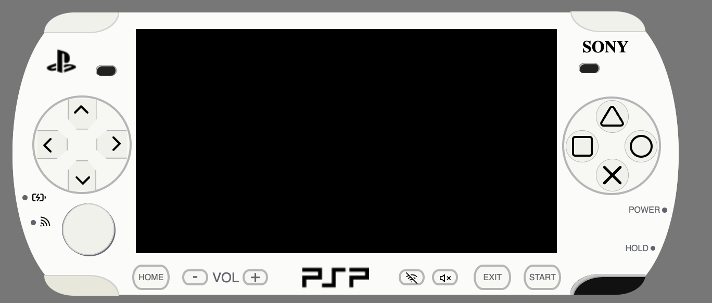
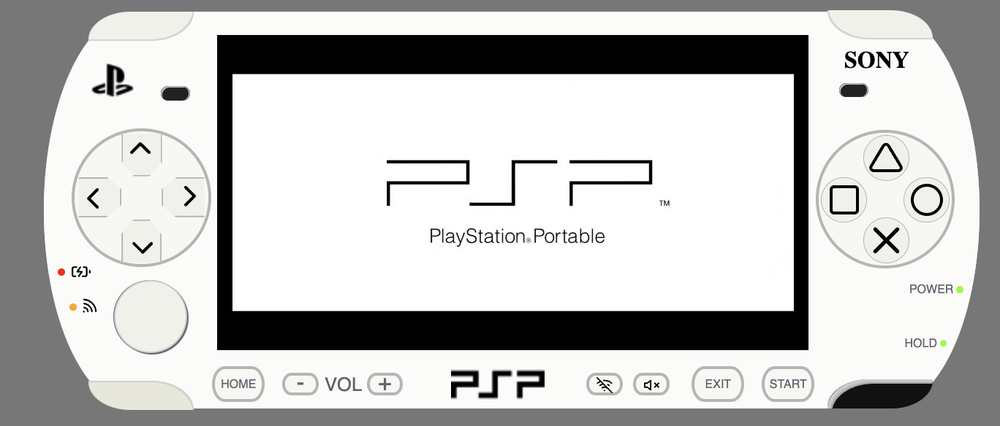
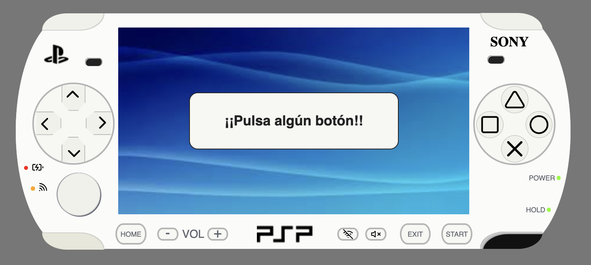

# PSP

En este Readme os presento mi versión de la PSP y las diferentes funciones que he añadido.

## Tecnologías utilizadas.

- HTML
- CSS
- JavaScript

## Manejo y funcionamiento

- **Encendido:** Cuando presionas el botón de power de abajo a la derecha, se inicia el video de introdución.
  
- **Start:** Una vez terminado el video de introducción, nos aparecerá una pantalla con la indicación de pulsar algún botón.
  
- **Botones:** Cada botón de la derecha emite un gif al pulsarlo. Si permaneces viendo dicho gif más de 3 segundos, volverá a aparecer la pantalla de inicio.

## Información de Contacto

- **Dirección:** Edificio Talent Garden. Calle de Juan de Marina 15, Madrid.
- **Teléfono:** +34 123-456-789
